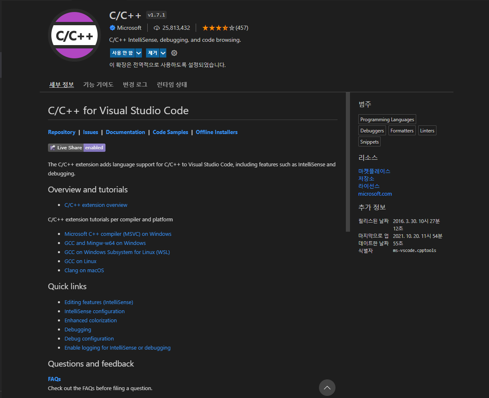
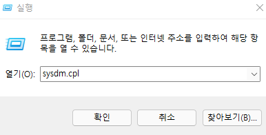
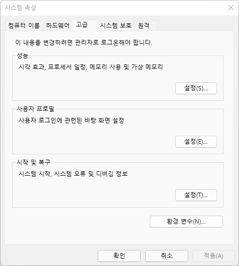
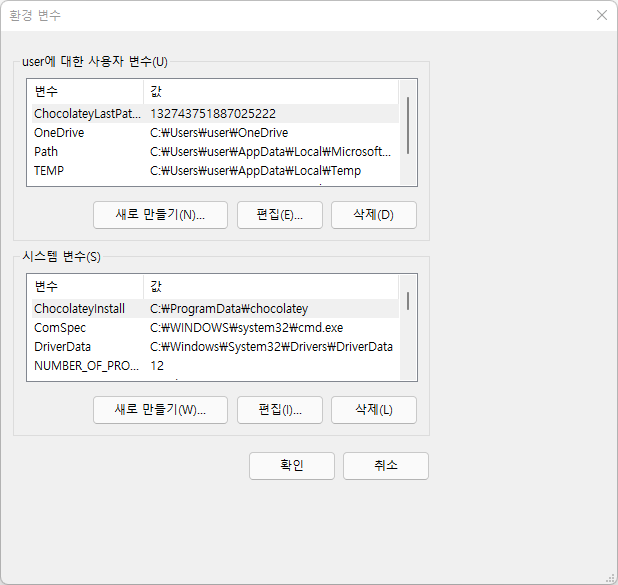
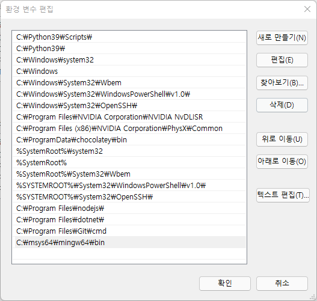
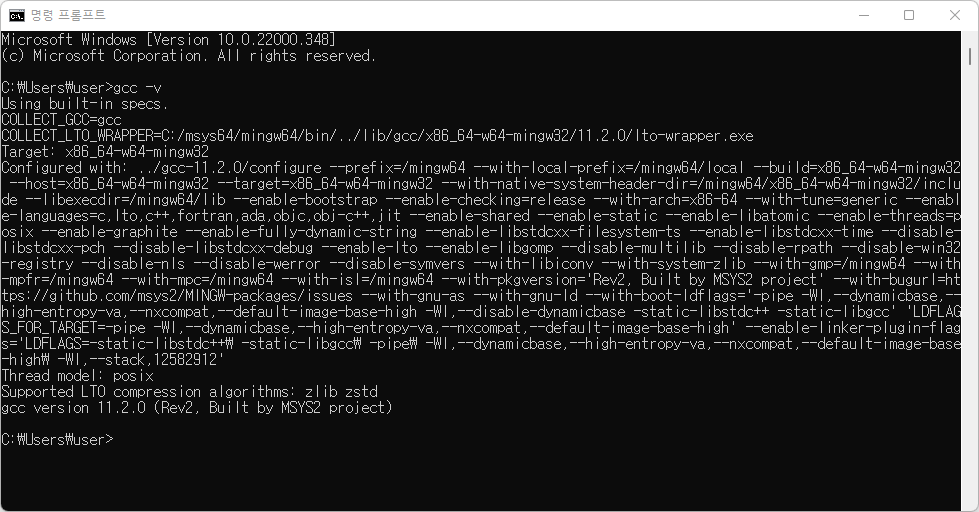

오늘부터는 윕 디자인이 아니라 기본적인 언어공부를 다시 시작해보기로 결심했다. 그래서 가장 먼저 시작한게 C언어!

우선 공부를 할려면 컴파일 할 수 있는 환경을 만들어야 한다. 내가 주로 쓰는 에디터는 vs code라서 여기에다가 환경을 만들어줄 예정이다.

우선 vs code에서 c/c++ 플러그인을 설치하자!

 

 

위 플러그인은 C언어 코드, 명령어를 인식해서 알기 쉽게 색깔을 칠해주는 역할을 한다. 그래서 컴파일과 디버깅을 하기 위해서는 'MinGW'를 설치해야 한다.

 
 
 

## #MinGW란?

'Minimalist GNU for Windows'의 약자로, 여러 오픈 소스 프로그램들을 윈도우에서 돌아가게 해주는 프로그램이다. 그냥 64비트 컴파일러라고 생각하면 쉬울 것 같다. 

아래 사이트에 가서 다운받아주자.
> https://www.msys2.org/

설치가 완료되면, MSYS2 커멘드 창을 열어주자.

그리고 2개의 명령어를 입력해주어야 한다.

> pacman -Syu;
> pacman -Su;

첫번째 명령어를 입력하고 y를 입력하면 알아서 파일들이 업데이트 된다. 완료되면 다시 한번 y를 눌러주게 되면 창이 닫히는데, MSYS2 커멘드 창을 열고 두번째 명령어를 입력해주면 된다.

자 그럼 기본적인 업데이트가 끝났고, 컴파일을 위한 mingw-w64와 몇가지 툴을 설치해야 한다.

> pacman -S --needed base-devel mingw-w64-x86_64-toolchain

를 입력해주자.

설치가 완료된 다음, '윈도우 + R'을 눌러서 실행창을 열어주고, sysdm.cpl을 입력하고 확인을 눌러주자.

 

 

고급 탭을 클릭하고 아래 보이는 환경 변수 버튼을 클릭한다.

 

 

시스템 변수에서 'Path'를 선택하고 편집 버튼을 클릭한다.

 

 

여기서 새로 만들기를 클릭한 후, 아래 경로를 입력해주자.
> C:\msys64\mingw64\bin

 

 

자! 거의 다왔다!

명령 프롬프트 창을 열어서 gcc -v 명령이 실행되는지 확인해보자.

 

 

자 다음은 컴파일에 필요한 패키지들을 설치해야 한다.

> sudo apt-get install build-essential

을 입력해서 설치해주자. 이제 vs code에서 빌드하면 끝@

후.....길고 긴 설치과정이 끝났다.....

이제부터 c언어 공부 시작해야징 (사실 포인터 빼면 얼추 기억나서 포인터만 집중적으로 공부할 예정)