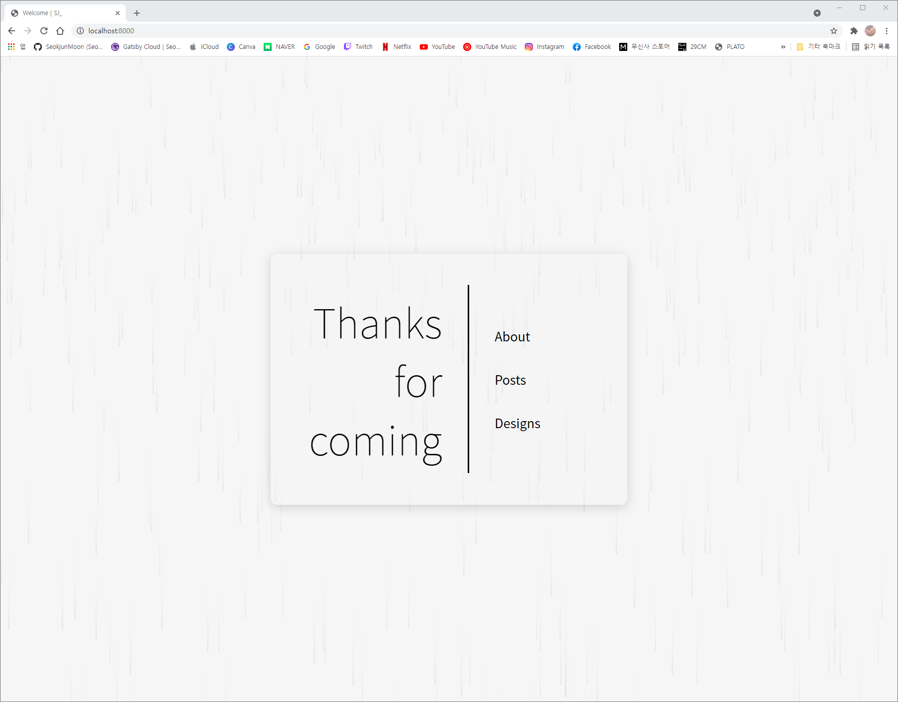

오늘은 뭘 해야할까.....도저히 좋은 아이디어가 안떠올랐다ㅜㅜ 오전에 운동 다녀오고 정신차린 후 오후부터 공부하기 시작했는데.....좋은 생각이 진짜 하나도 없었다ㅜㅜ 우르프 한판 하고 유튜브에서 애플워치 공홈 사전예약하는 방법이랑 배송 과정? 같은거 좀 찾아보고 놀고 있었다.

(tmi이긴 한데 공홈에서 애플워치 사전예약하면 정식 발매일인 15일날 받을 수 있도록 먼저 배송한다고 한다 ㅎㅎ 제주라서 하루정도는 늦을 수도 있겠다 싶지만, 뭐 그정도야 근데 늦게하면 얄짤없이 밀림 ㅋㅋㅋㅋㅋ 수강신청급 광클이 필요하다 이말이야~)

아무튼 그래서 주변 둘러보고 지금이 (여름같은) 가을이니까 가을하면 떠오르는거....낙엽, 단풍, 비? 뭐 이정도여서 가장 쉬운 비로 컨셉을 정했다. 그 다음부턴 조금 수월했다. 비? 하면 예전에 월페이퍼에서 봤던 비내리는 배경이 딱 떠올라서 바로 작업에 들어갔다.

<br/>

```javascript
React.useEffect(() => {
    const homeContainer = document.querySelector('#home\-container');
    for (let i = 0; i < 500; i++) {
        setTimeout(() => {
            const drop = document.createElement('span');


            drop.style.top = '0';
            drop.style.left = (Math.random() * 100) + 'vw';

            if (homeContainer != null) homeContainer.appendChild(drop);
        }, Math.random() * 1000);
    }
});
```

이렇게 물방울을 생성했다. React.useEffect 쓸 생각을 못하고 window.load 를 어떻게 쓸까 고민하다가 우연히 보게됨.....오늘도 하나 배우고 간다.....아무튼 좌표는 화면 상단의 랜덤한 좌표이기 때문에 Math.random()으로 정해줬다. 그리고 떨어지는 시간도 랜덤이기 때문에 setTimeout으로 딜레이도 주었다.

<br/>

그다음은 css에서 디자인 및 애니메이션 추가.

```css
.container span {
    position: absolute;
    width: 2px;
    height: 60px;
    background: linear-gradient(rgba(0, 0, 0, 0), 80%, rgb(222, 222, 222));
    opacity: 0.5;
    border: none;
    animation: animate 0.8s infinite ease-in;
    z-index: -1;
}


@keyframes animate {
    0% {
        top: -200px;
        height: 60px;
    }
    100% {
        top: 100vh;
        height: 200px;
    }
}
```
정말 간단했다. 배경은 당연히 지면쪽이 진하고, 하늘쪽이 더 투명?하기 때문에 linear-gradient로 배경을 설정했다. 그리고 투명도는 일단 50%만 줬고 애니메이션은 0.8초, 무한 반복, 처음에 느리다 점점 빨라지는 효과를 주어 완성. @keyframes 로 초기값과 최종값 셋팅만 해주면 끝! 이번엔 진짜 간단했다 ㅋㅋㅋㅋ 물방울 디자인이 정말 빡쌔서 그렇지......

<br/>

자 이렇게 해서 완성된 디자인은!

<br/>



<br/>

두둥

메인화면에서는 상단 메뉴 없애버리고 이렇게 가운데에 유리창 효과를 줘서 가운데에 배치했다. 지금은 가운데 로고랑 메뉴 디자인을 깜빡하고 안했어......이건 내일 해야지 ㅋㅋㅋ 내일 할게 좀 많네?! 아무튼 오늘도 얻어가는게 많아서 좋았다. 주말에는 쭉 정리하면서 복습해야징