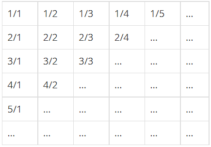

## #문제

무한히 큰 배열에 다음과 같이 분수들이 적혀있다.



이와 같이 나열된 분수들을 1/1 → 1/2 → 2/1 → 3/1 → 2/2 → … 과 같은 지그재그 순서로 차례대로 1번, 2번, 3번, 4번, 5번, … 분수라고 하자.

X가 주어졌을 때, X번째 분수를 구하는 프로그램을 작성하시오.

<br/>
<br/>

## #입력

첫째 줄에 X(1 ≤ X ≤ 10,000,000)가 주어진다.

<br/>
<br/>

## #출력

첫째 줄에 분수를 출력한다.

<br/>
<br/>

## #예제입/출력

- input: 1
    output: 1/1

- input: 2
    output: 1/2

- input: 3
    output: 2/1

- input: 4
    output: 3/1

- input: 5
    output: 2/2

- input: 6
    output: 1/3

- input: 7
    output: 1/4

- input: 8
    output: 2/3

- input: 9
    output: 3/2

- input: 14
    output: 2/4

<br/>
<br/>

## #풀이

흠.....지그재그로 분수들의 순번이 정해지고, N번째 분수를 구하는 문제. 일단 순번을 정하는 규칙부터 보자. 이것도 벌집 문제 처럼 좌측 상단부터 대각선으로 1층, 2층이라고 하면, 1층은 1/1 2층은 1/2, 2/1 이런식으로 나아가게 된다. 홀수층은 좌측 하단에서 우측 상단으로, 짝수층은 우측 상단에서 좌측 하단으로 방향이 정해진다. 그럼 여기서 한가지 규칙을 알 수 있다. 각 층은 홀/짝에 따라 방향이 정해진다! 

다음을 보면, 첫 행과 첫 열을 보면 각 층의 번호로 시작과 끝을 맺고 있다. 즉, 몇 층인지만 알면 분모 + 분자의 값을 알 수 있다는 말이다. 각 층에서 분모 + 분자의 값은 항상 같은데, 시작과 끝은 각각 분모와 분자가 1과 그 층의 숫자이기 때문에 이 문제도 해당 숫자의 층만 구하면 끝이다!

층은 어떻게 구할까? n보다 작거나 같을 때 까지(같은 경우는 각 층의 양 끝에 있는 경우이다) 변수 i를 계속 더해가면 된다. n층에 있는 숫자의 개수는 n이므로 layer 변수를 1씩 더해가면서 i에 더해줬다. 이렇게 몇층인지 구한 다음, 몇칸을 더 가야하는지 구하기 위해 rest 변수를 설정하였다. rest 변수는 n에서 내가 계산했던 i 만큼 빼주어 앞으로 더 계산해야 하는 횟수를 구했다. 그 다음 홀수/짝수에 따라 분모/분자에서 숫자를 1씩 증감을 했다. 

<br/>
코드는 다음과 같다

```javascript
function solution(n) {
    let result = [1, 1];

    let layer = 1, i = 1;
    while (i + layer <= n) {
        i += layer;
        layer++;
    }


    let rest = n - i;

    if(layer%2 === 0) {
        result = [rest + 1, layer - rest];
    }
    else {
        result = [layer - rest, rest + 1];
    }


    console.log(result[0] + "/" + result[1]);
}
```

글로 설명을 하니까 쉽지 않은 느낌....앞으로 더 많은 문제들을 풀면서 남에게 조리있게 설명하는 능력도 키워나가야 겠다!