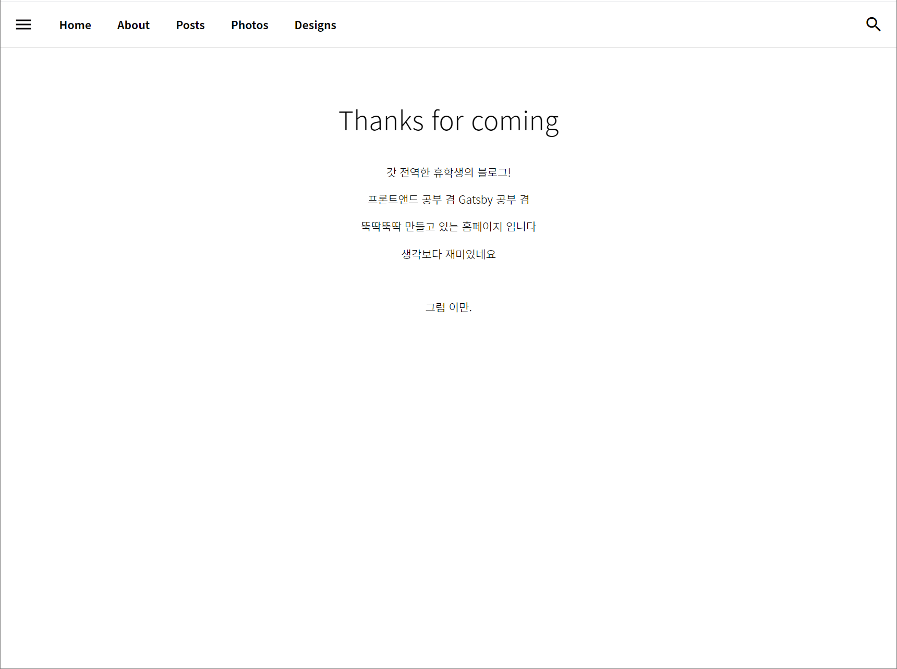

전역을 한 후, 예전부터 조금씩 해오던 블로그 개발을 본격적으로 시작하게 되었다!

Html만 쓸지 아니면 다른 워크프레임을 쓸지 고민하다가 React를 알게 되었다.

처음에는 React native를 쓸 생각이였지만

graphql에 홀려서(?) Gatsby 를 선택하였다

  

예~~~~전에 한 공부가 전부라서 Html에서 css, javascript 까지 

전부 새로 공부해야할 상황이여서 2주가 넘는 시간이 걸린 것 같다.

React란 무엇이며, Gatsby는 어떤건지, 빌드는 어떻게 하는지 등등

처음이긴 하였으나 중고등학생 시절 공부해둔 내용이 조금은 도움이 된 듯 했다.

  

그래서 마침내 탄생한 내 블로그.

배경에 이미지를 넣을까 아니면 캔버스 디자인을 넣을까 고민중이다!

상단 메뉴 디자인은 생각보다 금방 끝났다

폰트 크기, bold, hover 등 세세한 디자인만 조금 수정하고 처음과 똑같은 디자인이다

  

디자인이 가장 많이 바뀐 포스트 리스트 페이지다 ㅋㅋㅋㅋ

처음에는 제목 + 내용만 할지

아니면 썸네일 + 제목 + 내용을 할지

그리드로 할까, 이펙트는 넣을까, 그림자는 얼마나?

태그는 어떻게 하지?? 등등

무수한 고민으로 수십번의 디자인 변경 끝에,,,,,

어느정도 완성된 디자인이다 (근데 더 바꿀 것 같은 느낌 ㅋㅋㅋ)

  

나머지는 아직 미완성.

포스트 페이지만 완성되어 조금 끄적여봤다!

내일부터는 사진첩 만들어야지,,,,

