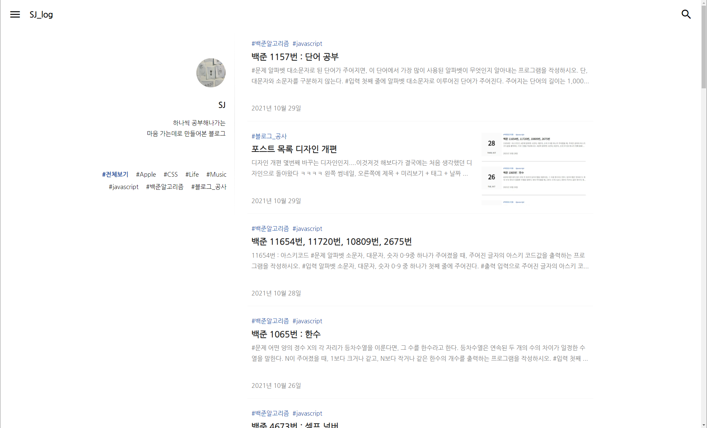

### 디자인 2차 개편

디자인을 또 변경했다,,,ㅎㅎ 큰 변화는 아니고 포스트 목록 화면에서 왼쪽에 프로필이랑 태그 목록들을 배치했다. 포스트 목록만 덩그러니 있을 때에는 너무 허전한 느낌이였는데 지금은 좀 괜찮아진 느낌이다. 저기 옆에 조금만 더 뭔가를 추가하고 싶은데 딱히 좋은 아이디어가 없어서 일단은 패스

 

 

수정하다가 생각난건데 이왕 이렇게 된거 포스트 프리뷰에서 썸네일 위치를 모바일이랑 태블릿 세로?? 정도까지는 상단에 좀 크게 배치하고 밑에 제목, 내용, 날짜, 태그 추가하는게 더 깔끔할 것 같아서 내일은 그거 작업해야징

이거만 다 끝나면 메인화면이랑 알고리즘 공부 다시 시작해야겠다 요즘 너무 놀았어....다음주에 부산도 갈건데 큰일났다 이거 완성은 하고 가고싶은데 가능할려나...?